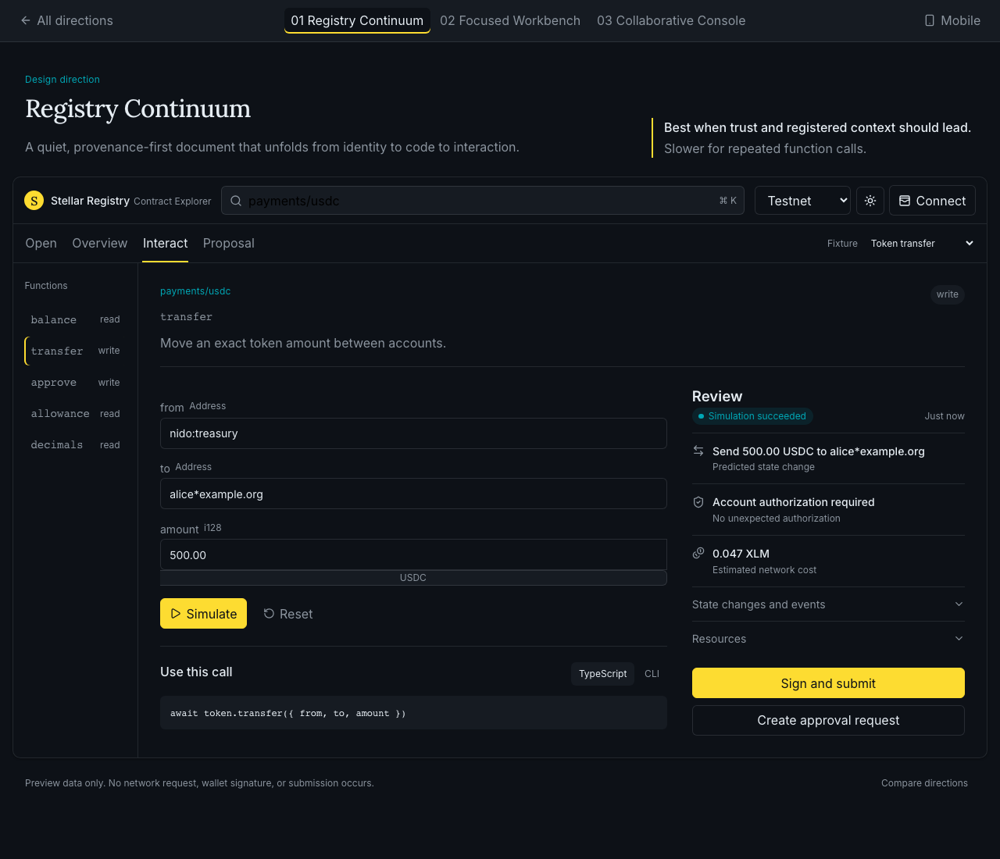
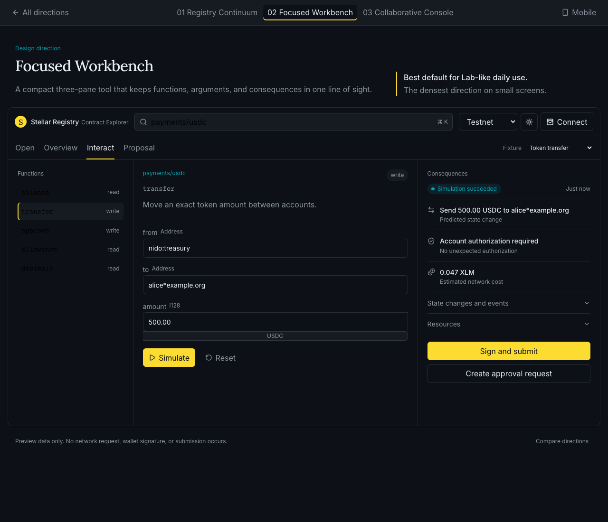
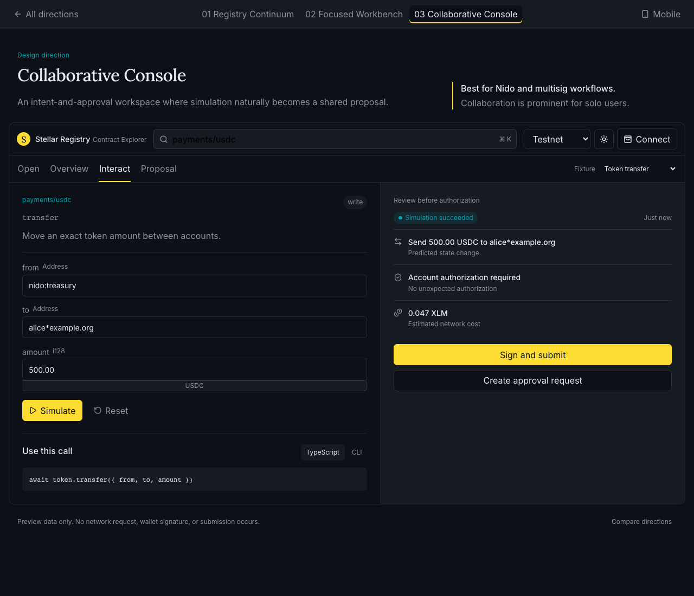
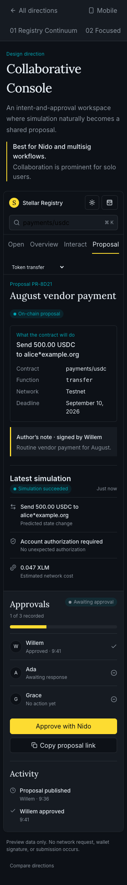

# Contract Explorer design previews

These are the three complete interaction directions proposed in PR #60. The
screens use deterministic fixtures: they never request a real signature or
submit a transaction.

## Preview locally

From the repository root:

```sh
npm ci
npm run dev
```

Then open the comparison at
[`http://localhost:5173/explorer-preview`](http://localhost:5173/explorer-preview).
The comparison links to every direction, and each direction includes desktop and
mobile controls, light and dark themes, fixtures, simulation, signing, and
proposal states.

Direct routes:

- `/explorer-preview/continuum`
- `/explorer-preview/workbench`
- `/explorer-preview/console`

## 01 — Registry Continuum



## 02 — Focused Workbench



## 03 — Collaborative Console



### Responsive example


